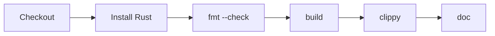
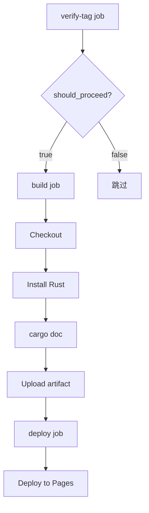
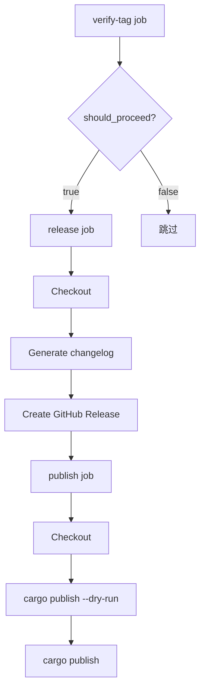
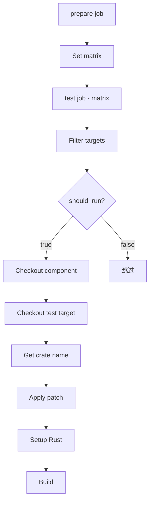
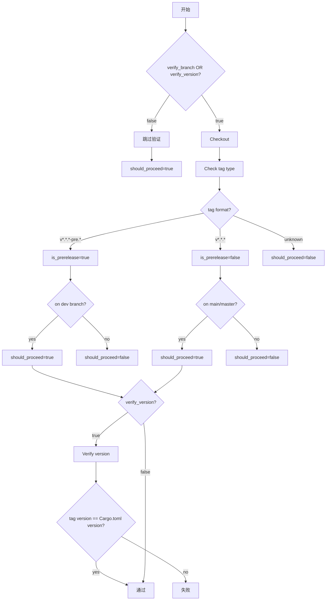
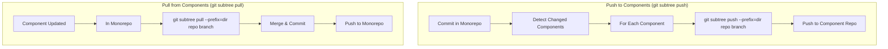

# 组件测试方案

AeceOS 生态的各个 `no_std` 组件的测试流程基于 **axci** 仓库提供的统一测试脚本和 GitHub Actions 工作流。测试分为**自动测试（CI）**和**本地测试**两种方式，前者通过统一的集成测试环境实现全面测试，后者用于本地开发验证。

## 概述

本仓库不仅提供可复用的 GitHub Actions 工作流，也提供了也提供了用于本地测试的统一测试脚本文件！其他组件仓库可以通过 `workflow_call` 引用这些工作流，避免在每个组件中重复维护 CI 配置。同时，也可以直接下载本仓库的本地测试脚本，实现统一的验证。

**目录结构：**

```
axci/
├── .github/
│   └── workflows/
│       ├── check.yml        # 代码检查
│       ├── test.yml         # 集成测试
│       ├── verify-tag.yml   # 标签验证
│       ├── deploy.yml       # 文档部署
│       └── release.yml      # 发布
├── check.sh                 # 本地代码检查脚本
├── tests.sh                 # 本地集成测试脚本
└── README.md
```

## 自动化测试（CI）

自动化测试测试是指的仓库代码中的 CI 相关脚本，CI 脚本可以使用我们在本地部署的完整的集成测试环境（https://github.com/orgs/arceos-hypervisor/discussions/373），从而实现全面的测试。

**工作流列表：**

| 工作流 | 功能 |
|--------|------|
| `check.yml` | 代码质量检查（fmt、clippy、build、doc） |
| `test.yml` | 集成测试（通过 patch 方式集成到测试目标） |
| `verify-tag.yml` | 验证版本标签（分支、版本一致性） |
| `deploy.yml` | 部署文档到 GitHub Pages |
| `release.yml` | 创建 GitHub Release 并发布到 crates.io |

### Check - 代码质量检查

#### 设计

`check.yml` 工作流执行代码质量检查，确保代码符合规范并能正确编译。

**执行过程：**



**详细步骤：**

1. **Checkout** - 检出代码
2. **Install Rust** - 安装 nightly 工具链及指定组件
3. **Check code format** - `cargo fmt --all -- --check`
4. **Build** - `cargo build --target <target> [--all-features]`（可设置 `skip_build: true` 跳过）
5. **Run clippy** - `cargo clippy --target <target> [--all-features] -- -D warnings`
6. **Build documentation** - `cargo doc --no-deps --target <target> [--all-features]`
   - 设置 `RUSTDOCFLAGS: -D rustdoc::broken_intra_doc_links -D missing-docs`

**输入参数：**

| 参数 | 说明 | 默认值 |
|------|------|--------|
| `all_features` | 是否使用 --all-features 标志 | true |
| `targets` | 编译目标 (JSON 数组) | `["aarch64-unknown-none-softfloat"]` |
| `rust_components` | Rust 组件 (逗号分隔) | `rust-src, clippy, rustfmt, llvm-tools` |
| `skip_build` | 是否跳过 build 步骤 | false |

#### 使用

在组件仓库创建 `.github/workflows/check.yml`：

```yaml
name: Check

on:
  push:
    branches: ['**']
    tags-ignore: ['**']
  pull_request:

jobs:
  check:
    uses: arceos-hypervisor/axci/.github/workflows/check.yml@main
```

**带可选参数：**

```yaml
jobs:
  check:
    uses: arceos-hypervisor/axci/.github/workflows/check.yml@main
    with:
      all_features: false
      targets: '["aarch64-unknown-none"]'
      rust_components: 'rust-src, clippy'
      skip_build: true
```

### Deploy - 文档部署

#### 设计

`deploy.yml` 工作流将文档部署到 GitHub Pages。

**执行过程：**



**详细步骤：**

1. **verify-tag job** - 调用 `verify-tag.yml` 验证标签合法性
2. **build job** - 构建文档
   - Checkout - 检出代码
   - Install Rust - 安装 nightly 工具链
   - Build docs - `cargo doc --no-deps --all-features`
     - 设置 `RUSTDOCFLAGS: -D rustdoc::broken_intra_doc_links -D missing-docs`
     - 生成重定向首页 `index.html`
   - Upload artifact - 上传文档产物
3. **deploy job** - 部署到 GitHub Pages
   - 使用 `actions/deploy-pages@v4` 部署

**输入参数：**

| 参数 | 说明 | 默认值 |
|------|------|--------|
| `verify_branch` | 验证标签是否在 main/master 分支 | true |
| `verify_version` | 验证 Cargo.toml 版本与标签一致 | true |

#### 使用

在组件仓库创建 `.github/workflows/deploy.yml`，推荐在版本标签推送时触发：

```yaml
name: Deploy

on:
  push:
    tags:
      - 'v[0-9]+.[0-9]+.[0-9]+'

jobs:
  deploy:
    uses: arceos-hypervisor/axci/.github/workflows/deploy.yml@main
```

### Release - 版本发布

#### 设计

`release.yml` 工作流创建 GitHub Release 并发布到 crates.io。

**执行过程：**



**详细步骤：**

1. **verify-tag job** - 调用 `verify-tag.yml` 验证标签合法性
2. **release job** - 创建 GitHub Release
   - Checkout - 检出代码（完整历史）
   - Generate release notes - 从上一个 tag 生成 changelog
     - `git log --pretty=format:"- %s (%h)" "${PREV_TAG}..${CURRENT_TAG}"`
   - Create GitHub Release - 使用 `softprops/action-gh-release@v2`
     - 稳定版本：`prerelease: false`
     - 预发布版本：`prerelease: true`
3. **publish job** - 发布到 crates.io
   - Checkout - 检出代码
   - Install Rust - 安装 nightly 工具链
   - Dry run publish - `cargo publish --dry-run`
   - Publish to crates.io - `cargo publish --token $CARGO_REGISTRY_TOKEN`

**输入参数：**

| 参数 | 说明 | 默认值 |
|------|------|--------|
| `verify_branch` | 验证标签是否在正确分支 | true |
| `verify_version` | 验证 Cargo.toml 版本与标签一致 | true |

**Secrets：**

| Secret | 说明 |
|--------|------|
| `CARGO_REGISTRY_TOKEN` | crates.io 的 API token |

#### 使用

在组件仓库创建 `.github/workflows/release.yml`，推荐在版本标签推送时触发：

```yaml
name: Release

on:
  push:
    tags:
      - 'v[0-9]+.[0-9]+.[0-9]+'
      - 'v[0-9]+.[0-9]+.[0-9]+-pre.[0-9]+'

jobs:
  release:
    uses: arceos-hypervisor/axci/.github/workflows/release.yml@main
    secrets:
      CARGO_REGISTRY_TOKEN: ${{ secrets.CARGO_REGISTRY_TOKEN }}
```

**版本发布流程：**

稳定版本：
```bash
# 1. 更新 Cargo.toml 中的版本号
# 2. 提交并推送到 main/master
git commit -am "chore: release v1.0.0"
git push origin main

# 3. 创建标签
git tag v1.0.0
git push origin v1.0.0
```

预发布版本：
```bash
# 1. 在 dev 分支工作
git checkout dev

# 2. 更新版本号
# 3. 提交并推送
git commit -am "chore: release v1.0.0-pre.1"
git push origin dev

# 4. 创建标签
git tag v1.0.0-pre.1
git push origin v1.0.0-pre.1
```

### Test - 集成测试

#### 设计

`test.yml` 工作流运行集成测试，通过 patch 方式将组件集成到测试目标中构建验证。测试同时支持 **QEMU 模拟器** 和 **物理开发板** 两中测试环境，两种环境的执行流程完全一致。

**执行过程：**



**详细步骤：**

1. **prepare job** - 准备测试矩阵
   - 输出默认测试目标配置（axvisor, starry）
2. **test job** - 并行执行测试（每个 target 一个 job）
   - Filter test targets - 根据 `test_targets` 输入过滤
   - Checkout component - 检出被测组件到 `component/`
   - Checkout test target - 检出测试目标仓库到 `test-target/`
   - Get component crate name - 从 Cargo.toml 检测或使用输入值
   - Apply patch to Cargo.toml - 添加 `[patch.crates-io]` 覆盖依赖
   - Setup Rust - 安装 nightly 工具链
   - Build - 执行构建命令（带超时控制）

**输入参数：**

| 参数 | 说明 | 默认值 |
|------|------|--------|
| `crate_name` | 组件 crate 名称 | 自动检测 |
| `test_targets` | 测试目标（逗号分隔或 "all"） | all |
| `skip_build` | 跳过构建 | false |

**默认测试目标：**
- `axvisor` - https://github.com/arceos-hypervisor/axvisor
- `starry` - https://github.com/Starry-OS/StarryOS

**测试矩阵（axvisor）：**

| 类型 | 架构 | Guest OS | 说明 |
|------|------|----------|------|
| QEMU | aarch64 | ArceOS | QEMU aarch64 虚拟机 |
| QEMU | aarch64 | Linux | QEMU aarch64 虚拟机 |
| QEMU | x86_64 | NimbOS | QEMU x86_64 虚拟机 |
| Board | aarch64 | ArceOS | Phytiumpi 开发板 |
| Board | aarch64 | Linux | Phytiumpi 开发板 |
| Board | aarch64 | ArceOS | ROC-RK3568-PC 开发板 |
| Board | aarch64 | Linux | ROC-RK3568-PC 开发板 |

#### 使用

在组件仓库创建 `.github/workflows/test.yml`：

```yaml
name: Test

on:
  push:
    branches: [master, main, dev]
    tags-ignore: ['**']
  pull_request:
  workflow_dispatch:

jobs:
  test:
    uses: arceos-hypervisor/axci/.github/workflows/test.yml@main
```

**带可选参数：**

```yaml
jobs:
  test:
    uses: arceos-hypervisor/axci/.github/workflows/test.yml@main
    with:
      crate_name: 'arm_vcpu'
      test_targets: 'axvisor'
```

## 本地测试

本仓库提供了两个本地测试脚本，用于在开发阶段提交代码前进行快速验证。

### check.sh - 本地代码检查

`check.sh` 脚本用于在本地执行与 CI `check.yml` 工作流相同的代码质量检查，包括：
- **fmt** - 代码格式检查
- **build** - 构建检查
- **clippy** - Clippy 静态分析
- **doc** - 文档构建检查

**用法：**

```bash
# 检查单个组件
./check.sh <crate> [target]

# 检查所有组件
./check.sh all [target]
```

**参数：**
- `crate` - 组件名称（如 axvcpu、axaddrspace 等）或 `all`
- `target` - 目标架构（可选，默认 `aarch64-unknown-none-softfloat`）

**支持的目标架构：**
- `aarch64-unknown-none-softfloat`（默认）
- `x86_64-unknown-none`
- `riscv64gc-unknown-none-elf`

**示例：**

```bash
# 检查 axvcpu 组件（默认目标）
./check.sh axvcpu

# 检查 axvcpu 组件（指定目标）
./check.sh axvcpu x86_64-unknown-none

# 检查所有组件
./check.sh all

# 检查所有组件（指定目标）
./check.sh all riscv64gc-unknown-none-elf
```

### tests.sh - 本地集成测试

`tests.sh` 脚本用于在本地执行与 CI `test.yml` 工作流类似的集成测试，通过 patch 方式将组件集成到测试目标（axvisor、starry）中进行验证。***同样提供了 QEMU 中测试以及链接本地开发板进行测试两种测试环境支持！***

**用法：**

```bash
./tests.sh [选项]
```

**选项：**
- `-c, --component-dir DIR` - 组件目录（默认：当前目录）
- `-f, --config FILE` - 配置文件路径（可选）
- `-t, --target TARGET` - 测试目标（默认：all）
- `-o, --output DIR` - 输出目录（默认：COMPONENT_DIR/test-results）
- `-v, --verbose` - 详细输出
- `--no-cleanup` - 不清理临时文件
- `--dry-run` - 仅显示将要执行的命令
- `--sequential` - 顺序执行测试（不并行）
- `-h, --help` - 显示帮助信息

**测试目标：**
- `all` - 运行所有测试
- `axvisor-qemu` - 运行所有 axvisor QEMU 测试
- `axvisor-board` - 运行所有 axvisor Board 测试
- `starry` - 运行所有 starry 测试
- 或指定具体测试目标（如 `axvisor-qemu-aarch64-arceos`）

**示例：**

```bash
# 运行所有测试
./tests.sh

# 仅运行 axvisor QEMU 测试
./tests.sh -t axvisor-qemu

# 仅运行 axvisor Board 测试
./tests.sh -t axvisor-board

# 仅运行 starry aarch64 测试
./tests.sh -t starry-aarch64

# 仅运行 phytiumpi ArceOS 测试
./tests.sh -t axvisor-board-phytiumpi-arceos

# 显示将要执行的命令（不实际运行）
./tests.sh --dry-run -v
```

**镜像下载：**
- 镜像将从 https://github.com/arceos-hypervisor/axvisor-guest/releases/v0.0.22 自动下载
- 存储位置：`/tmp/.axvisor-images`

## 附录：verify-tag.yml

`verify-tag.yml` 是内部工作流，被 `deploy.yml` 和 `release.yml` 调用，用于验证版本标签的合法性。

**执行过程：**



**详细步骤：**

1. **Skip all verifications** - 如果 `verify_branch=false` 且 `verify_version=false`，直接通过
2. **Checkout code** - 检出代码（完整历史）
3. **Check tag type and branch** - 检查标签类型和分支
   - 预发布标签 `v*.*.*-pre.*` 必须在 `dev` 分支
   - 稳定标签 `v*.*.*` 必须在 `main` 或 `master` 分支
   - 未知格式标签拒绝通过
4. **Verify version consistency** - 验证版本一致性（如果 `verify_version=true`）
   - 比较标签版本与 `Cargo.toml` 中的 `version` 字段

**输入参数：**

| 参数 | 说明 | 默认值 |
|------|------|--------|
| `verify_branch` | 验证标签是否在正确分支 | true |
| `verify_version` | 验证 Cargo.toml 版本与标签一致 | true |

**输出：**

| 输出 | 说明 |
|------|------|
| `should_proceed` | 是否继续执行 deploy/release |
| `is_prerelease` | 是否为预发布标签 |

## Sync - 代码同步（Git Subtree）

`sync.yml` 工作流和 `sync.sh` 脚本使用 **git subtree** 在 monorepo 和组件仓库之间进行双向同步，完整保留 commit 历史。

### 设计

tgoskits 使用 git subtree 管理所有组件，这意味着：
- ✅ 所有组件代码都直接在主仓库中
- ✅ 完整保留了所有 commit 历史
- ✅ 可以选择性地将修改推送回原仓库
- ✅ 可以从原仓库拉取更新

**同步方向：**

1. **Monorepo → 组件仓库**：使用 `git subtree push` 将 monorepo 中的修改推送到组件仓库
2. **组件仓库 → Monorepo**：使用 `git subtree pull` 从组件仓库拉取更新到 monorepo

**执行过程：**



**Git Subtree 命令：**

```bash
# 从 monorepo 推送到组件仓库
git subtree push --prefix=<component_dir> <component_repo_url> <branch>

# 从组件仓库拉取更新到 monorepo
git subtree pull --prefix=<component_dir> <component_repo_url> <branch>
```

**输入参数：**

| 参数 | 说明 | 默认值 |
|------|------|--------|
| `sync_direction` | 同步方向：push-to-components 或 pull-from-components | push-to-components |
| `component_name` | 组件名称（pull 时必需） | - |
| `component_branch` | 组件分支 | 自动检测（main/master/dev） |
| `dry_run` | 仅显示将要同步的内容 | false |

**Secrets：**

| Secret | 说明 |
|--------|------|
| `SYNC_TOKEN` | 具有仓库写入权限的 GitHub Token |

### 使用 - Monorepo (tgoskits)

在 monorepo 中创建 `.github/workflows/sync.yml`：

```yaml
name: Sync

on:
  workflow_run:
    workflows: ["Check", "Test"]
    types:
      - completed
    branches: [main, dev]
  workflow_dispatch:

jobs:
  sync:
    if: github.event.workflow_run.conclusion == 'success' || github.event_name == 'workflow_dispatch'
    uses: arceos-hypervisor/axci/.github/workflows/sync.yml@dev
    with:
      sync_direction: 'push-to-components'
    secrets:
      SYNC_TOKEN: ${{ secrets.SYNC_TOKEN }}
```

**本地同步脚本：**

```bash
# 推送所有修改的组件到各自的仓库
./sync.sh --push

# 推送特定组件
./sync.sh --push --component axvcpu

# 从组件仓库拉取更新
./sync.sh --pull --component axvcpu

# 仅显示将要同步的内容（不实际执行）
./sync.sh --push --dry-run
```

**手动 Git Subtree 命令：**

```bash
# 推送 arceos 组件到原仓库的 dev 分支
git subtree push --prefix=arceos https://github.com/arceos-org/arceos.git dev

# 从 arceos 仓库拉取更新
git subtree pull --prefix=arceos https://github.com/arceos-org/arceos.git dev

# 推送 axvcpu 组件
git subtree push --prefix=axvcpu https://github.com/arceos-hypervisor/axvcpu.git main

# 从 axvcpu 仓库拉取更新
git subtree pull --prefix=axvcpu https://github.com/arceos-hypervisor/axvcpu.git main
```

### 使用 - 组件仓库

**重要说明：** Git subtree 同步必须在 **monorepo 端** 执行，不能从组件仓库端执行。组件仓库**不需要**任何特殊的同步脚本或工作流。

要从组件仓库同步修改，在 tgoskits monorepo 中执行：

```bash
# 从组件仓库 → Monorepo
cd /path/to/tgoskits
./sync.sh --pull --component axvcpu

# 从 Monorepo → 组件仓库
./sync.sh --push --component axvcpu
```

### 配置要求

1. **SYNC_TOKEN 配置**
   - 在仓库设置中添加 `SYNC_TOKEN` secret
   - Token 需要有 `repo` 权限（用于推送代码）
   - 可以使用 GitHub App 或 Personal Access Token

2. **Cargo.toml 配置**
   - 组件的 Cargo.toml 中需要包含 `repository` 字段
   - 示例：`repository = "https://github.com/arceos-hypervisor/axvcpu"`

3. **分支策略**
   - 建议使用相同的分支名称（如 main, dev）
   - 确保目标分支在目标仓库中存在

### 常见问题

**Q: 为什么不能从组件仓库端执行同步？**

A: Git subtree 在 monorepo 中维护子树结构。所有 subtree 操作（push/pull）都必须在包含该子树的仓库中执行。

**Q: 如何解决冲突？**

A: 如果 `git subtree pull` 产生冲突，需要手动解决：
```bash
# 拉取时产生冲突
git subtree pull --prefix=axvcpu https://github.com/.../axvcpu.git main

# 查看冲突文件
git status

# 手动解决冲突
vim <conflicted_file>

# 提交解决
git add .
git commit
```

**Q: 如何查看组件的 commit 历史？**

A: 使用 git log 查看特定目录的历史：
```bash
git log --oneline -- axvcpu/
```

## License

Apache-2.0
